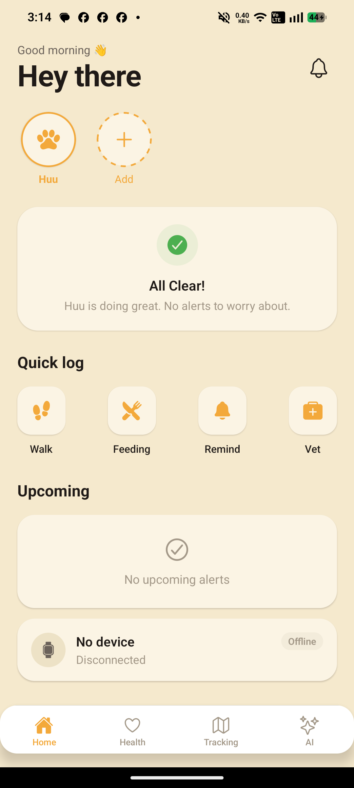
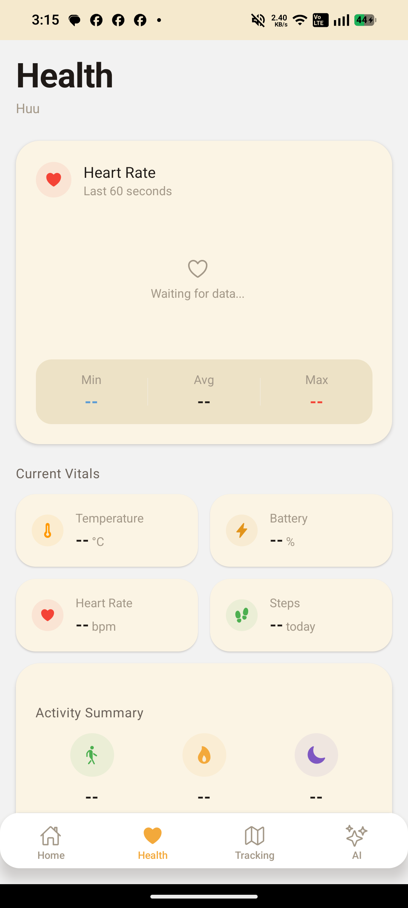
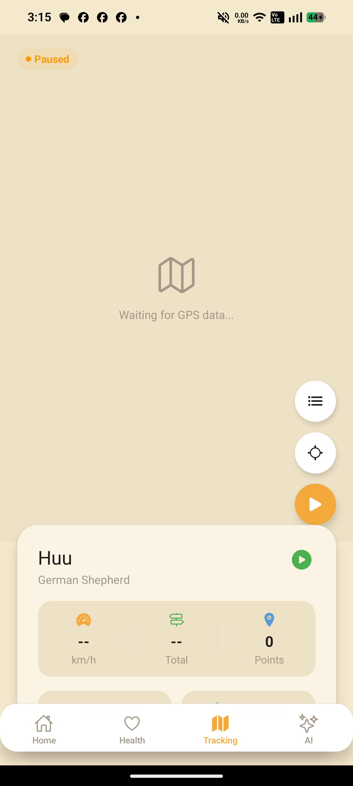
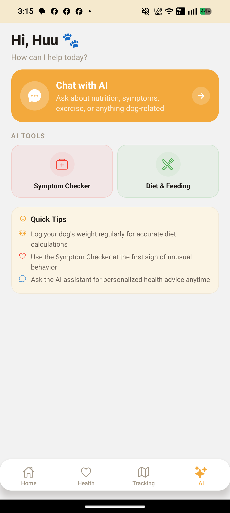

# DogVita

Smart wearable dog health monitoring system. A React Native app that connects to an ESP32-S3 dog collar via BLE for real-time health tracking, GPS geofencing, and alert notifications. Includes an on-device AI assistant powered by llama.rn and a Next.js CRM dashboard.

## Features

- **Heart Rate Monitoring** — Real-time BPM tracking with configurable high/low alerts
- **GPS Tracking** — Live location on OpenStreetMap with geofence boundaries
- **Activity Tracking** — Step count, distance, and activity level scoring
- **Sleep Tracking** — Sleep duration and quality analysis
- **Environmental Monitoring** — Ambient temperature and humidity from collar sensors
- **Alert System** — Push notifications for health anomalies and geofence breaches
- **AI Health Assistant** — On-device LLM (llama.rn) for symptom checking, diet recommendations, and health Q&A
- **Voice Interaction** — Voice input/output for the AI assistant
- **CRM Dashboard** — Next.js admin panel for monitoring users, subscriptions, and alerts
- **Supabase Backend** — Cloud sync, auth, and data persistence

## Screenshots

| Dashboard | Health | Tracking | AI Chat |
|-----------|--------|----------|---------|
|  |  |  |  |

## Architecture

```
DogVita/
├── dog-health-app/              # React Native app (bare workflow)
│   ├── app/
│   │   ├── screens/             # 10 screen groups
│   │   │   ├── onboarding/      # Welcome, Login, SignUp, OTP, Dog Profile, Pair Device
│   │   │   ├── dashboard/       # Main dashboard
│   │   │   ├── health/          # Health overview
│   │   │   ├── tracking/        # GPS tracking, geofences, route history
│   │   │   ├── alerts/          # Alert list
│   │   │   ├── settings/        # App settings
│   │   │   ├── dog/             # Dog profile, vaccinations, weight history
│   │   │   ├── ai/              # AI overview, symptom checker, diet/feeding
│   │   │   ├── chatbot/         # Chat interface + history
│   │   │   └── device/          # Device management
│   │   ├── services/            # BLE, API, auth, GPS, notifications, AI, storage
│   │   ├── store/               # Zustand stores (dog, health, ble, tracking, alert, settings, chat)
│   │   ├── components/          # Reusable UI (maps, dog cards)
│   │   ├── navigation/          # React Navigation 7 (tabs + stack)
│   │   ├── types/               # TypeScript interfaces
│   │   ├── theme/               # Colors, spacing, typography tokens
│   │   └── config/              # App constants
│   └── android/                 # Native Android project
├── crm/                         # Next.js CRM dashboard
│   ├── app/                     # Pages (login, dashboard)
│   ├── components/              # UI components (sidebar, charts, tables)
│   ├── lib/                     # Queries, types, utilities
│   └── store/                   # Session and UI state
└── graphify-setup/              # Knowledge graph tooling
```

## Tech Stack

### Mobile App

| Layer | Technology |
|-------|------------|
| Framework | React Native 0.76 (bare workflow) |
| Language | TypeScript 5.3 (strict) |
| State | Zustand 5 with AsyncStorage persistence |
| Navigation | React Navigation 7 (Bottom Tabs + Native Stack) |
| Backend | Supabase (auth, database, realtime) |
| BLE | react-native-ble-plx |
| Maps | react-native-maps + OpenStreetMap |
| Charts | react-native-gifted-charts |
| Forms | react-hook-form + Zod validation |
| Icons | react-native-vector-icons/Ionicons |
| Local AI | llama.rn (on-device LLM inference) |
| Voice | Voice input/output service |

### CRM Dashboard

| Layer | Technology |
|-------|------------|
| Framework | Next.js (App Router) |
| Styling | Tailwind CSS |
| State | Zustand |
| Charts | Recharts |

## Quick Start

### Prerequisites

- Node.js 18+
- Android Studio (with SDK at default path)
- JAVA_HOME pointing to Android Studio's bundled JDK

### Mobile App

```bash
git clone https://github.com/MontageStark/DogVita.git
cd DogVita/dog-health-app
npm install
cp .env.example .env        # configure Supabase + BLE UUIDs
npx react-native run-android
```

### CRM Dashboard

```bash
cd crm
npm install
cp .env.example .env
npm run dev
```

### Scripts (Mobile)

| Command | Description |
|---------|-------------|
| `npm run android` | Build and run on Android |
| `npm run typecheck` | TypeScript type checking |
| `npm run lint` | ESLint |
| `npm run clean` | Clear cache + reinstall |

## Auth Flow

Phone number + OTP authentication via Supabase:

1. **Welcome** — Intro screen with login/signup
2. **Login / Sign Up** — Email+password or phone number
3. **Verify OTP** — Enter 6-digit code
4. **Dog Profile** — Add dog name, breed, weight, age
5. **Pair Device** — BLE scan and connect to ESP32-S3 collar
6. **Dashboard** — Main app

> Test mode: any phone + OTP `123456` works when Supabase is not configured.

## BLE Protocol

Communicates with ESP32-S3 collar over BLE:

| Service | UUID | Data |
|---------|------|------|
| Heart Rate | `0x180D` | BPM, RR interval |
| GPS | Custom | Lat/lng coordinates |
| Temperature | Custom | Ambient temp (°C) |
| Battery | `0x180F` | Charge level (%) |
| Activity | Custom | Step count, activity level |

Packet format: little-endian binary frames parsed in `app/services/ble/packetParser.ts`.

## AI Features

On-device AI powered by llama.rn:

- **Symptom Checker** — Describe symptoms, get potential causes and recommendations
- **Diet & Feeding** — Breed-specific nutrition advice and feeding schedules
- **Health Q&A** — General pet health questions answered locally
- **Voice Input** — Speak questions to the assistant
- **Model Management** — Download and switch between GGUF models

## State Management

Zustand stores with AsyncStorage persistence:

| Store | Responsibility |
|-------|---------------|
| `dogStore` | Dog profiles, active dog selection |
| `healthStore` | Heart rate, temperature, activity history |
| `bleStore` | Connection state, device info, scan results |
| `trackingStore` | GPS coordinates, geofence boundaries |
| `alertStore` | Alert history, notification preferences |
| `settingsStore` | Onboarding state, app preferences |
| `chatStore` | AI chat history and session state |

## Build

### Android

```bash
cd dog-health-app/android
$env:ANDROID_HOME="C:\Users\User\AppData\Local\Android\Sdk"
.\gradlew.bat app:assembleDebug --no-daemon
```

### Regenerate Native Projects

```bash
npx react-native prebuild --clean
```

## License

MIT
